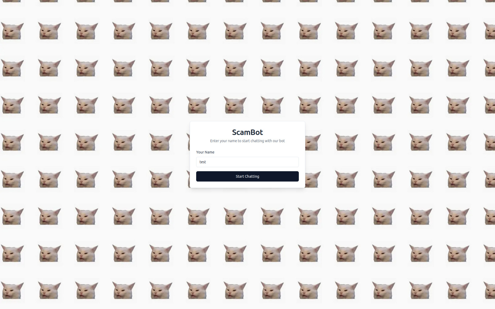
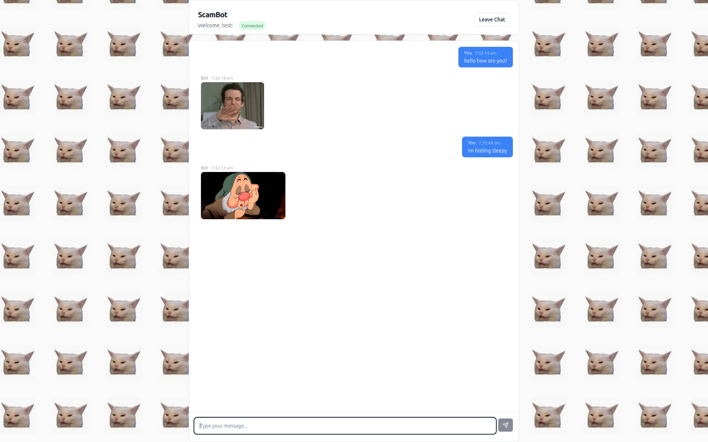
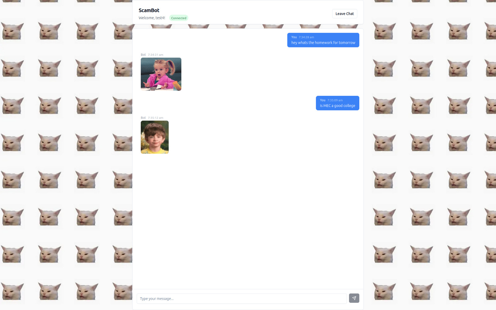

# ScamBot 🤖


## Basic Details
### Team Name: Meow


### Team Members
- Team Lead: Vasanth R - Govt Model Engineering College
- Member 2: Niranjana Siju - Govt Model Engineering College


### Project Description
An intelligent bot that replies only with sarcasm and gifs.

### The Problem (that doesn't exist)
Lack of an emotionally unavailable friend to text to .

### The Solution (that nobody asked for)
Made the ultimate bot that fills in the gap of your emotionally unavailable friend.

## Technical Details
### Technologies/Components Used
For Software:
- JavaScript
- Next.js
- socket.io, openai sdk
- vs code, giphy api

### Implementation
For Software:
# Installation
```bash
cd client && npm i
cd ../server && npm i
```

# Run
```bash
cd client && npm run dev
cd ../server && npm run dev
```

### Project Documentation
For Software:

# Screenshots (Add at least 3)

This is the landing page where user submits their name before chatting with the bot.


A sample conversation with the bot.


A sample conversation with the bot.

### Project Demo
# Video
[\[Add your demo video link here\]](https://drive.google.com/file/d/1UBrSyvZrnzyoM5-0PcpvjbC0llhAHLQW/view?usp=sharing)
*This video shows how an user can starting chatting to our bot*


## Team Contributions
- Vasanth R: socket chatapp, ai integration
- Niranjana Siju: idea, Giphy api integration

---
Made with ❤️ at TinkerHub Useless Projects 


